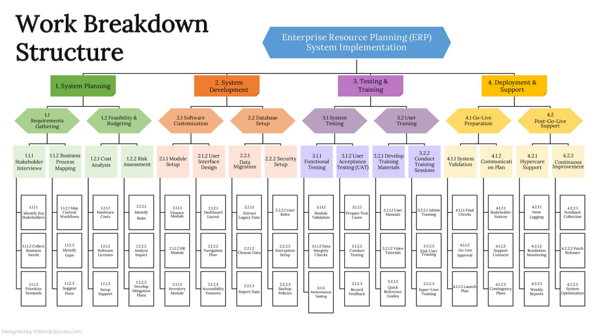

# Partes de una función

1. Nombre 
2. Datos de Entrada
3. Proceso
4. Datos de Salida

---
 

---

# Características de una buena función

* _Simple_ : Tiene el mínimo de componentes para cumplir su propósito
* _Reutilizable_ : Puede ser utilizada para resolver el mismo problema dentro de otros sistemas
* _Verificable_ : Es posible construir otras funciones para verificar que entregue los resultados correctos 
* _Documentado_ : Está acompañado de la documentación necesaria para que otras personas puedan reutilizarla o mejorarla 
