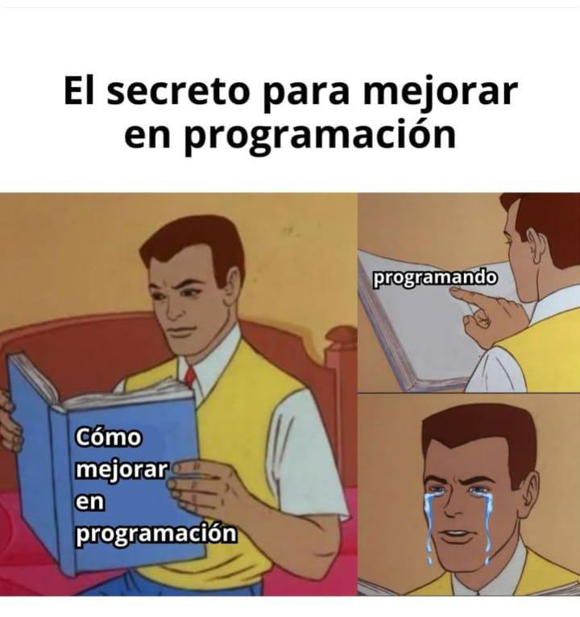

Programar es como la vida y muchos de los principios que se aplican para escribir codigo, también se aplican para vivir en el mundo real.

# La ley fundamental de la ingeniería 

*Cualquier problema complejo puede resolverse si se divide en una cantidad adecuada de problemas mas simples*

# Las tres verdades dolorosas del oficio de programador

Construir software implica tomar decisiones todo el tiempo. Estas tres verdades son una colección de sabiduría adquirida con la experiencia, que pretenden ayudarles a decidir bien.

## Los computadores no hacen lo que uno quiere, sino lo que uno les dice

Cualquiera puede soñar con que el computador haga lo que desea, pero para lograr que lo haga se necesita plasmar los deseos en forma de ordenes objetivas.

## Un programa es una colección de errores corregidos, qué en el mejor de los casos funciona

El error no es fracaso, es solo estar un paso más cerca del objetivo.

El orgullo nos impulso a negar nuestros errores, pero solo podemos corregirlos aceptandolos, enfrentandolos y persistiendo, incluso cuando siguen sin funcionar.

## Las soluciones de hoy, son los problemas de mañana

Siempre habrán dos formas de hacer las cosas: una fácil y otra correcta

La fácil parece costar menos esfuerzo al principio, pero con el tiempo va a requerir mas esfue4zo para corregir lo que no se hizo bien desde el principio

