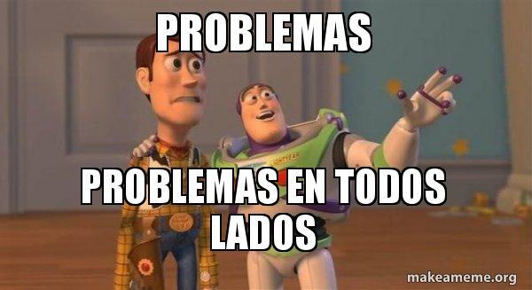
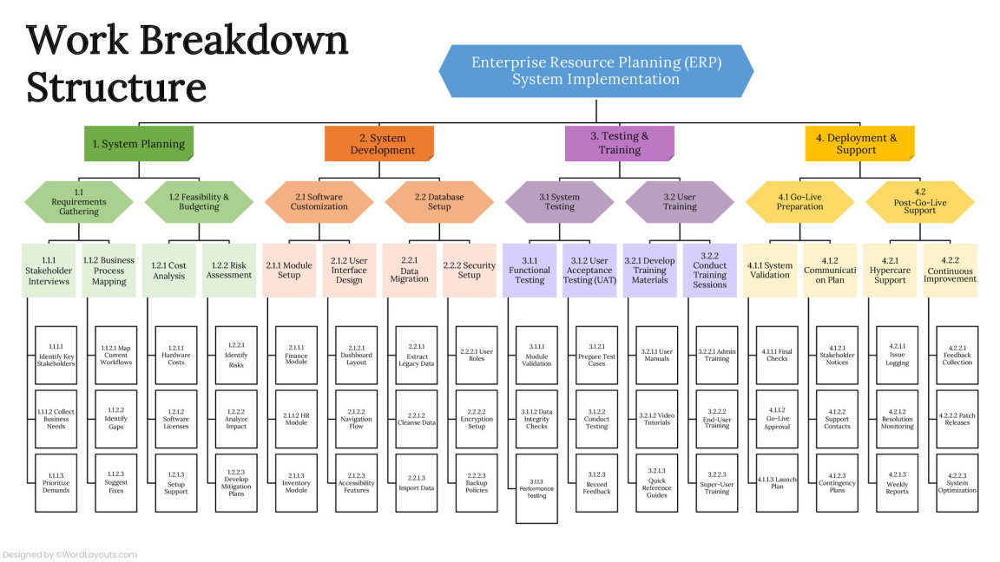

# Materia Lenguajes de Programación y Código Limpio

## Profesor William David Velásquez

### Contacto

 welasquez [arroba] udemedellin.edu.co 

### Página del Curso

 
Github: https://github.com/ProfeBill

---

# Evaluación

## Entregas Proyecto de Aula

* Seguimiento 1 : 35%  (Septiembre 4)
    * Tema 1 : Pruebas Unitarias 17.5%
    * Tema 2 : Código Limpio 17.5%
* Seguimiento 2 : 40% (Octubre 23)
    * Tema 3 : Interfaz Gráfica 20%
    * Tema 4 : Bases de Datos 20%
* Evento Evaluativo Final : 25%
    * Entrega Final : Aplicación web

---

# Condiciones del Proyecto de Aula

- Consulte la [lista de proyectos](projects.md) o también puede proponer el suyo propio.
-	Equipos de 2 estudiantes, solo en caso de que los matriculados en el curso sean impares, se permite un equipo de 3
-	Cada equipo debe contactar a un experto que les ayude a entender el problema y redactar los casos de prueba. la entrevista con el experto debe ser grabados en video o audio.
-	De la entrevista con el experto el equipo debe identificar las variables de entrada y salida, así como las fórmulas que deben utilizar para realizar los cálculos
- usando las variables y las fórmulas suministradas por el experto deberán construir un libro de Excel con al lo menos 10 casos de prueba del problema
-	El equipo debe tener un repositorio en GitHub, donde hacen la entrega, y en la UVirtual van a suministrar la URL del proyecto

---

# Hora de Elegir Representante del Curso
    

---

# ¿Por qué estudiaste esta carrera?

---

# La ley fundamental de la ingeniería 

*Cualquier problema complejo puede resolverse si se divide en una cantidad adecuada de problemas mas simples*

---

# Paréntesis: ¿Nos podemos ir? Es que la IA resuelve los problemas por nosotros.

---

# Inteligencia Artificial vs Brutalidad Natural

La IA no es el genio de la lámpara, es un empleado barato recién contratado, eso significa que: 
* Usted debe ser más inteligente
* Usted debe darle límites e instrucciones claras
* Usted debe verificar si hizo bien el trabajo
* Usted debe pagarle por su trabajo

--- 

# La característica más peligrosa de la IA: **Complaciente**

* Nunca le va a contestar: No sé 
* Nunca va a decirle: Estás equivocado
* Solo va a admitir que se equivocó cuando usted lo corrija, incluso si tenía la razón

---

# Principios de Seguridad

* No le pida que escriba el código fuente de algo que usted no sabe hacer en papel
* Antes de empezar, tenga escritas las pruebas que usará para verificar si hizo bien su trabajo
* Divida el trabajo en tareas pequeñas, fáciles de hacer, fáciles de verificar
* No conserve nada que usted no entienda como funciona, o no pueda mejorar después si tiene que modificarlo
* Aproveche lo barato de la IA, para volver a empezar desde cero, cada vez que descubra que había una forma mejor y más simple de hacer las cosas
* Piense en todas las formas en que su nueva creación puede fallar, y escriba nuevas pruebas por cada una de ellas
---
# De regreso a los problemas

[Cómo hacer un computador desde cero](https://circuitverse.org/simulator/4-bit-binary-adder-final-v3)

---

---

# Finalmente, recuerde: 

La IA aprendió todo lo que sabe resolviendo problemas, cada problema que ella resuelve por usted, es una habilidad que ella gana y una que usted deja de ganar
