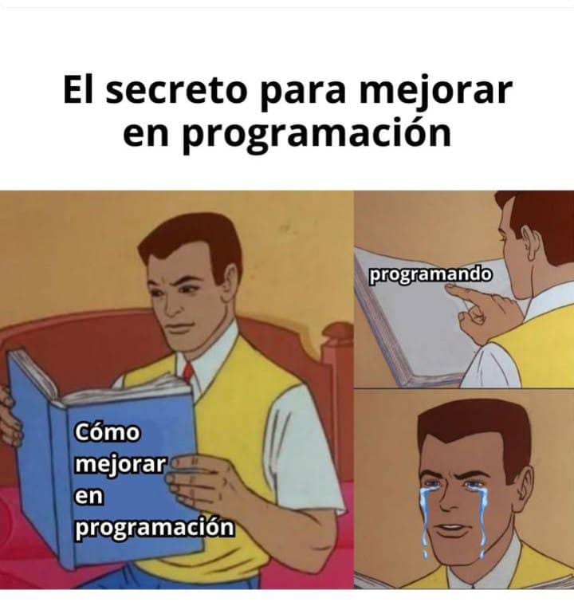

# Las tres verdades dolorosas del oficio de programador

Construir software implica tomar decisiones todo el tiempo. Estas tres verdades son una colección de sabiduría adquirida con la experiencia, que pretenden ayudarles a decidir bien.

---

## Los computadores no hacen lo que uno quiere, sino lo que uno les dice

Cualquiera puede soñar con que el computador haga lo que desea, pero para lograr que lo haga se necesita plasmar los deseos en forma de ordenes objetivas.

---

## Un programa es una colección de errores corregidos, qué en el mejor de los casos funciona

El error no es fracaso, es solo estar un paso más cerca del objetivo.

El orgullo nos impulsa a negar nuestros errores, pero solo podemos corregirlos aceptándolos, enfrentándolos y persistiendo, incluso cuando el programa sigue sin funcionar.

---

## Las soluciones de hoy, son los problemas de mañana

Siempre habrán dos formas de hacer las cosas: una fácil y otra correcta.

La fácil parece costar menos esfuerzo al principio, pero con el tiempo va a requerir mas esfuerzo para corregir lo que no se hizo bien desde el principio.

